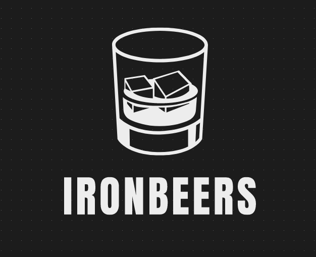

# **IROBEERS**

(Project Module 2 Ironhack)

 

 Demo [HERE](https://drink20.herokuapp.com) **IROBEERS**

### Introduction

* Project module 2, Web Development course Ironhack wdpt may 2021.

* Application created with react to simulate a beverage e-commerce store.
### 📋 Requirements to play

* Internet

## 📦 Development

* REACT   
* JAVASCRIPT 
* LIBRARIES, AND OTHER EXTENSIONS

### 🎁 Expressions of gratitude

* I would like to thank the **Ironhack** school for the experience and learning that is provided to us.
The teachers **Daniel K Albanez (DK)**, **Gabriel Sicuto** and **Júlia Foresti**, for the way that the content is presented in the classroom and the support of doubts inside and outside the classroom.
Thank you very much for this second module 🤓.

---
**Developer:** ⌨️ with ❤️ by [Jhonatan Veras](https://github.com/jhonatanveras) 😊
**Developer:** ⌨️ with ❤️ by [Renan Oliveira](https://github.com/RenanOliveira20) 😊
